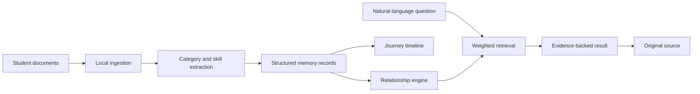

# MemoryVerse AI

> **Your academic story, connected.**

MemoryVerse AI is a Digital Identity System built for the MemoryVerse AI '26 Hackathon. It transforms scattered student evidence—certificates, projects, internships, resumes, achievements, and learning records—into a structured, searchable digital journey.


## The problem

Students accumulate valuable documents across drives, mailboxes, and devices. Traditional storage can save those files, but it cannot explain how a certification connects to a skill, project, internship, or career path.

MemoryVerse turns those disconnected records into a searchable personal knowledge repository—while keeping the original source available.

## Features

- **Memory library:** upload and browse academic or professional evidence.
- **Intelligent organization:** local categorization into projects, skills, certifications, internships, achievements, and academic records.
- **Relationship engine:** connects documents through shared extracted skills and shows evidence confidence.
- **Journey timeline:** converts dated milestones into a visual growth narrative.
- **Natural-language retrieval:** ask questions such as “Show my AI projects” or “What supports my Python skill?”
- **Original evidence access:** open the source record from every relevant result.
- **Free and local:** no account, API key, backend, or cloud dependency is required for the demo.

## Demo walkthrough

1. Open the app and ask **“Show my AI projects.”**
2. Ask **“What supports my Python skill?”** to retrieve related evidence.
3. Open **Connections** to show why the system links certificates, projects, and internships.
4. Open **Journey timeline** to show growth from 2023 to 2026.
5. Open **Memory library**, upload a document, and show the new local record.
6. Click **Open original** to demonstrate source preservation.

## Run locally

No installation is needed.

```bash
# Option 1: open index.html directly in a browser

# Option 2: run the full local Python application
python server.py
```

Then visit `http://localhost:8080`. This starts the Python backend for persistent uploads, local analysis, retrieval, and original-file downloads.

## Architecture



The current prototype uses transparent, browser-side keyword and weighted matching so it can run for free and offline. The production-ready AI evolution is documented in [docs/ARCHITECTURE.md](docs/ARCHITECTURE.md).

## Tech stack

- HTML5
- CSS3
- Vanilla JavaScript
- Browser `localStorage` for local metadata persistence
- Browser Object URLs for original-file access in the active session

## Project structure

```text
memoryverse-ai/
├── index.html                 # App structure and screens
├── styles.css                 # Responsive visual design
├── app.js                     # Ingestion, retrieval, links, timeline
├── server.py                  # Python API: upload, analysis, search, storage
├── docs/
│   ├── ARCHITECTURE.md         # Current and production AI architecture
│   ├── architecture-diagram.svg# Upload-ready architecture diagram
│   └── THOUGHT_PROCESS.md      # Design decisions for evaluation
├── LICENSE
└── README.md
```

## Evaluation alignment

| Hackathon criterion | MemoryVerse response |
| --- | --- |
| Quality of AI organization | Auto-categorization, extracted skill tags, searchable evidence |
| AI/ML technical stack | Clear production plan for NLP, embeddings, vector search, RAG, and relationship mapping |
| Innovation & UX | A personal growth timeline with explainable relationships |
| Clarity & architecture | Visible data flow, source-backed retrieval, and documented decisions |

## Documentation

- [Architecture and AI evolution](docs/ARCHITECTURE.md)
- [Thought process and design decisions](docs/THOUGHT_PROCESS.md)

## License

Released under the [MIT License](LICENSE).
