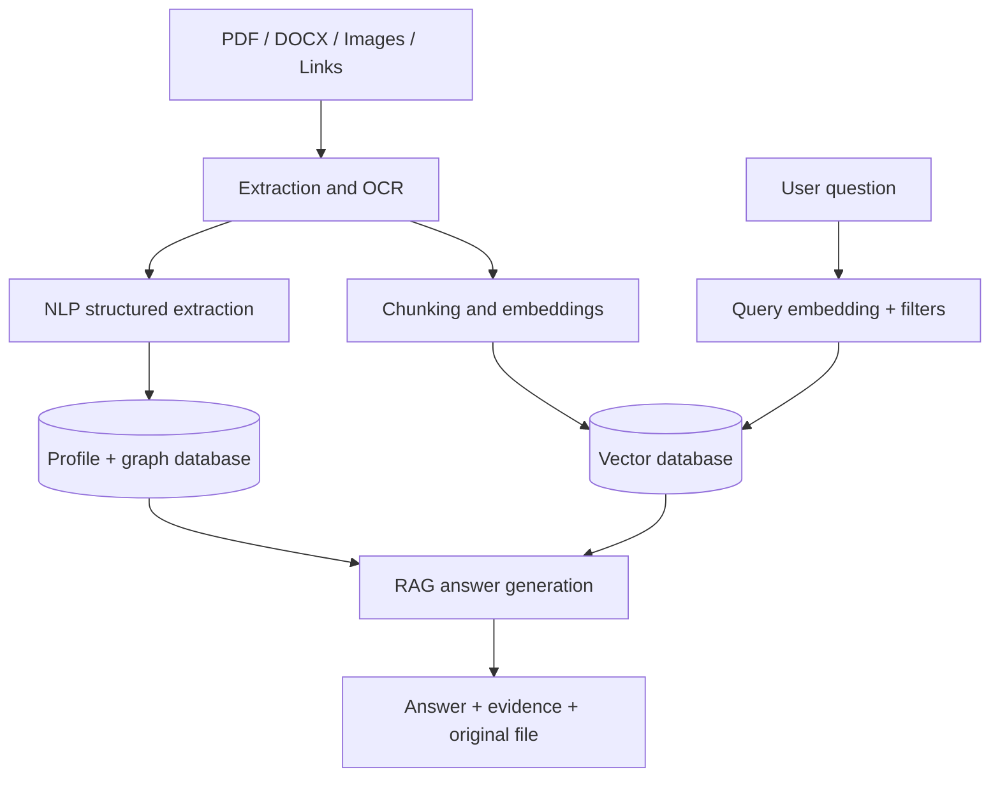

# MemoryVerse Architecture

## Prototype architecture

The submitted prototype uses a dependency-free Python server and browser client so it can be demonstrated without API keys, paid services, or deployment risk.

```text
File upload -> Python filename, text, and metadata analysis -> memory record
                                           -> category and skills
Memory records -> shared-skill matching -> explainable relationships
Natural-language query -> weighted matching -> ranked source records
Dates in records -> ordered milestones -> journey timeline
```

The scoring is explainable: a document gets stronger retrieval weight for a matching category, extracted skill, title, organisation, and source summary. A relationship confidence score combines the number of shared skills with date proximity. Python persists uploaded source files and extracted records locally under `data/`.

## Production AI architecture



## Recommended production components

| Layer | Recommended approach |
| --- | --- |
| Text extraction | PyMuPDF for PDFs, python-docx for DOCX, Tesseract OCR for scanned images |
| Structured extraction | LLM or local NER model with JSON schema: category, skills, dates, organisation, achievements |
| Embeddings | `sentence-transformers` local model or embedding API |
| Vector store | ChromaDB or FAISS for a local implementation |
| Relationships | SQLite/NetworkX or Neo4j graph; store type, confidence, rationale, and source id |
| Retrieval | Query embedding + metadata filters + reranking + RAG answer grounded in retrieved chunks |
| Source preservation | Store original file id/path with every record and citation |

## Privacy principles

1. Preserve the original document rather than replacing it with generated data.
2. Attach every extracted fact and generated connection to source evidence.
3. Give the user a direct way to inspect the source file.
4. Keep the prototype local by default.
